# 一、搭建说明

1. 数据库用的是jpa技术，可以帮你自动构建数据库表，只需要你在配置文件中修改数据

```yml
spring:
  datasource:
    driver- class-name: com.mysql.jdbc.Driver
    # 表名：spirngboot_blog，时区设置：serverTimezone=GMT%2B（本人数据库有问题，需要加上时区设置）
    url: jdbc:mysql://localhost:3306/springboot_blog?serverTimezone=GMT%2B8&useUnicode=true&characterEncoding=utf-8
    username: root
    password: ----------
```

# 二、图片展示

注：页面展示需要联网下载展示图片

注：页面可以直接通过打开项目html文件查看效果

项目默认地址为：http://localhost:8080/


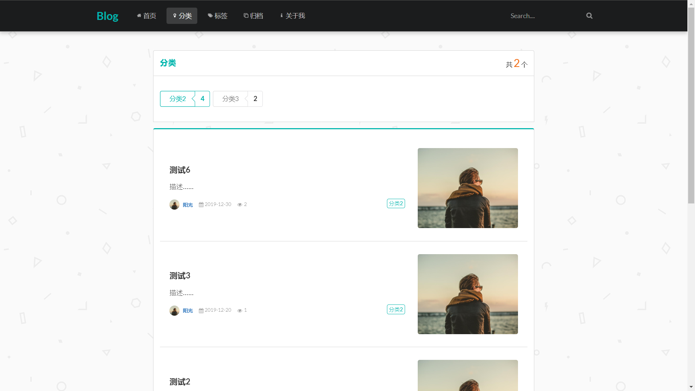


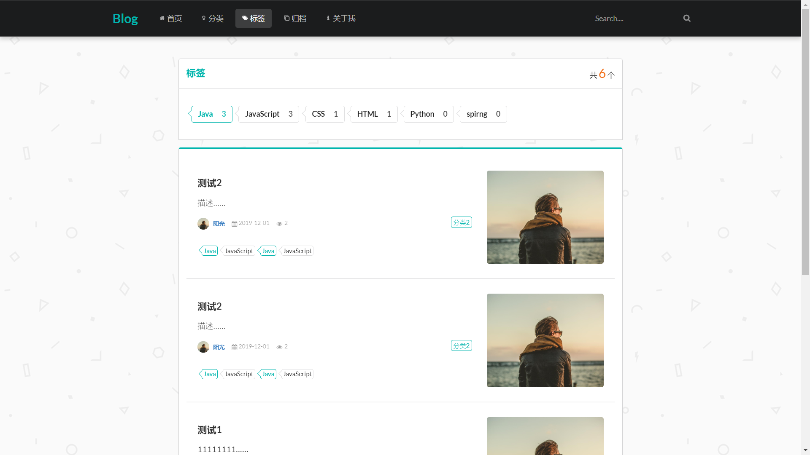


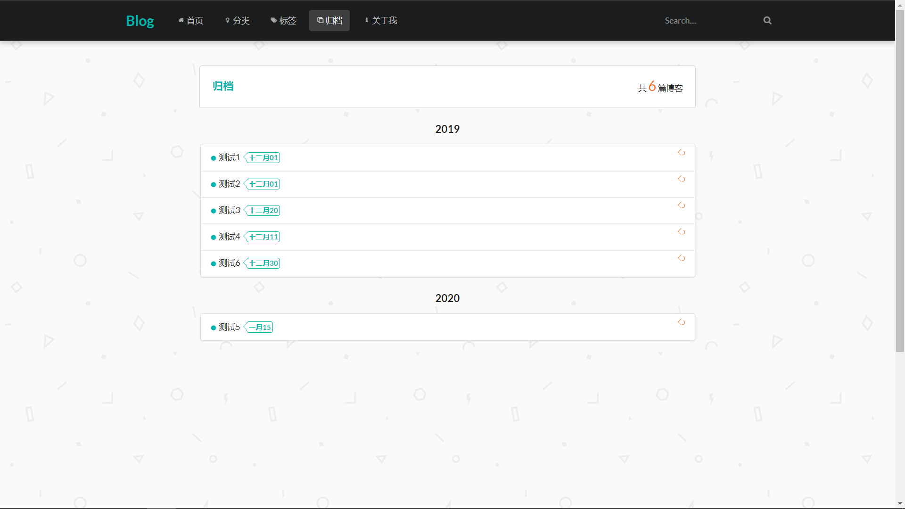


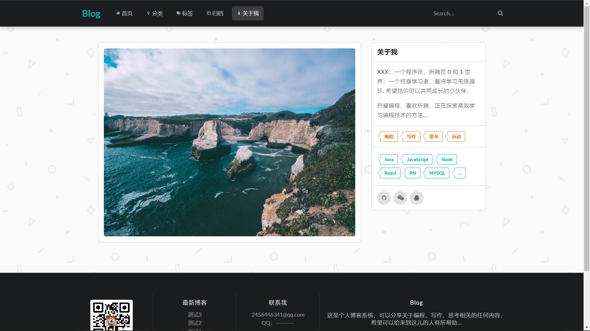


博客详情：

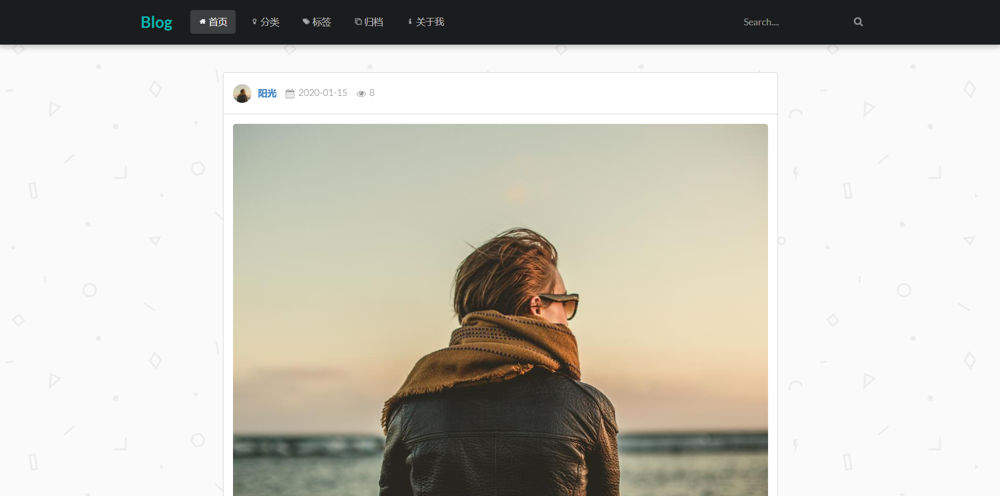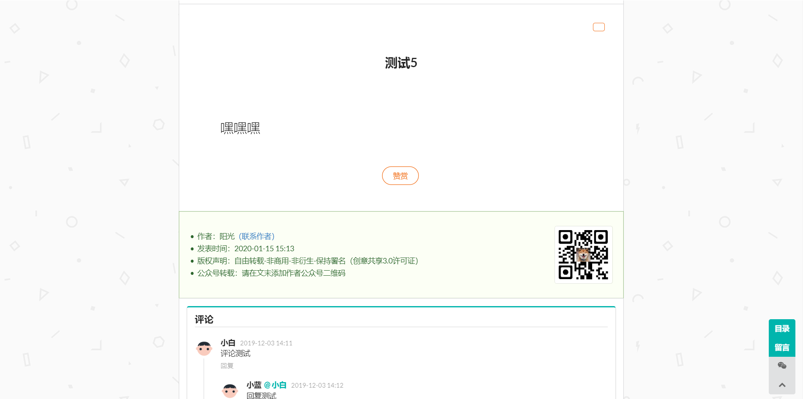

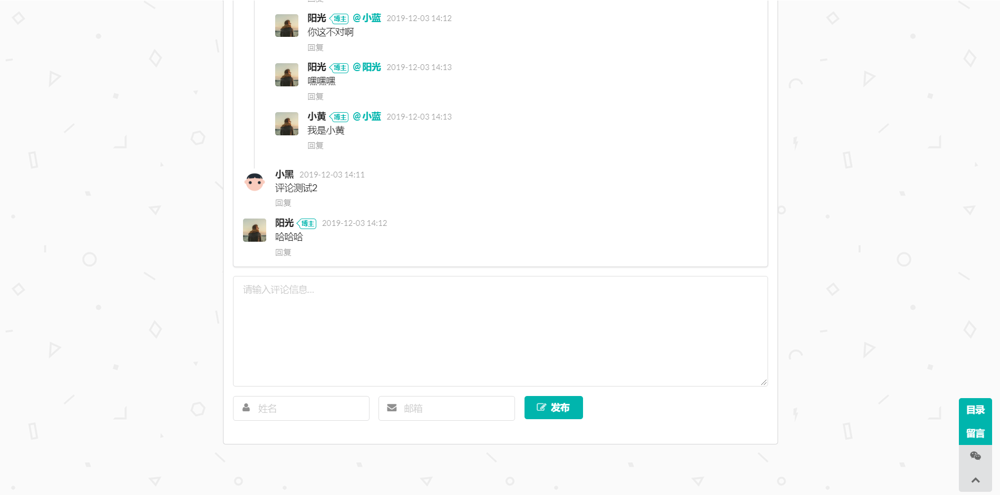


后台管理：http://localhost:8080/admin

初始化管理员数据

```mysql
insert into `t_user` ( `avatar`, `password`, `update_time`, `id`, `nickname`, `email`, `create_time`, `type`, `username`) values ( 'https://unsplash.it/100/100?image=1005', '96e79218965eb72c92a549dd5a330112', '2019-10-15 12:36:23', '1', '管理员', '123@qq.com', '2019-10-15 12:36:04', '1', 'admin');
```

用户名：admin
密码：111111

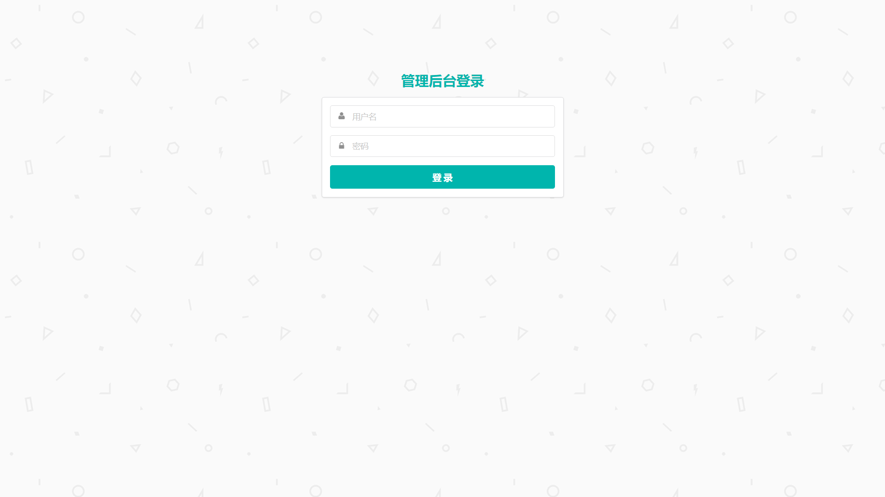


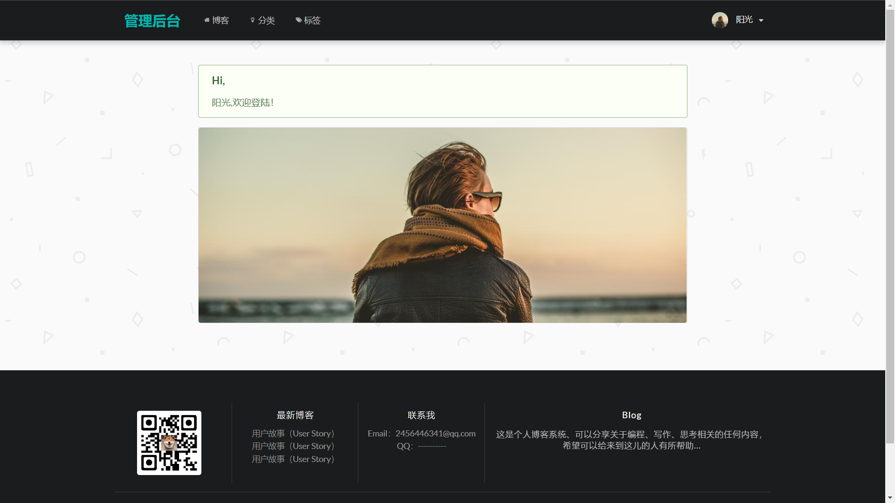


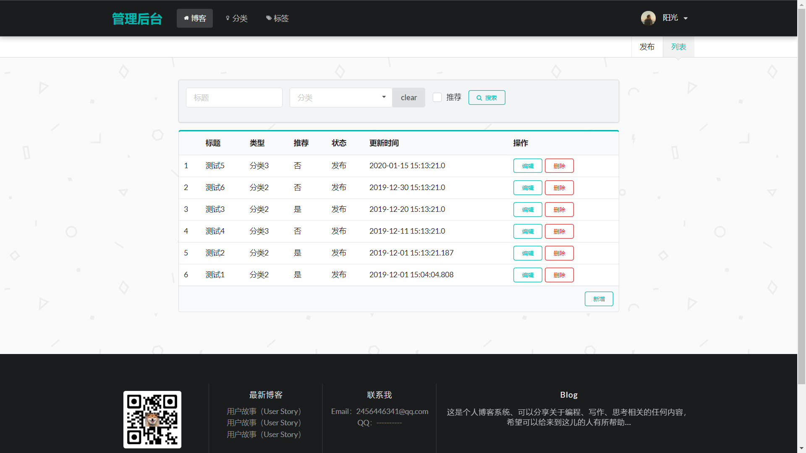


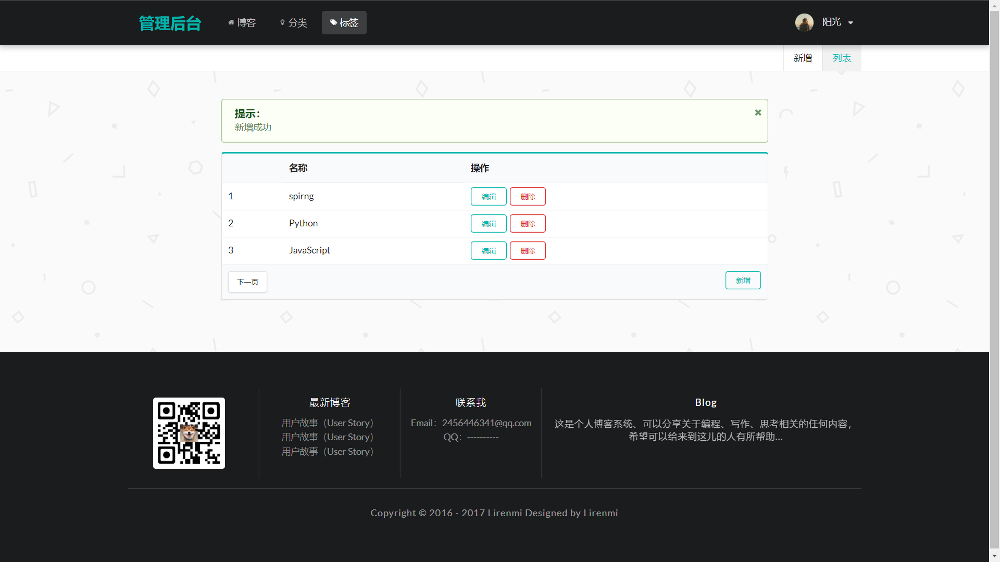


博客编辑用的是markdown。

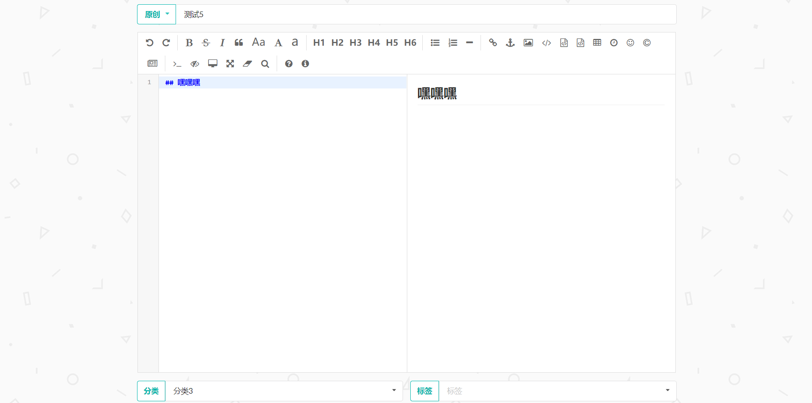

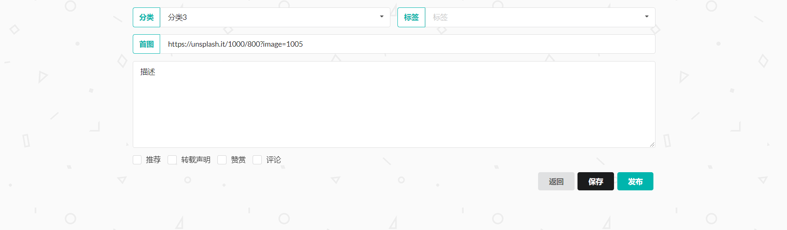